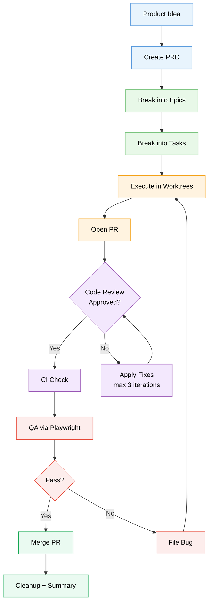

# GHPMplus Plugin

Autonomous GitHub Project Management workflow with orchestrator-agent coordination for parallel task execution via git worktrees, automated code review, and QA testing.

## Overview

GHPMplus extends the original GHPM plugin with autonomous execution capabilities. While GHPM requires manual step-by-step command invocation (create PRD -> create epics -> create tasks -> execute), GHPMplus automates the entire workflow through a central orchestrator agent with integrated review cycles and QA.

### Key Differences from GHPM

| Feature            | GHPM                | GHPMplus                            |
| ------------------ | ------------------- | ----------------------------------- |
| Workflow           | Manual step-by-step | Autonomous end-to-end               |
| Task Execution     | One at a time       | Parallel via worktrees              |
| Agent Coordination | None                | Orchestrator + sub-agents           |
| Code Review        | Manual              | Automated review cycle (max 3 iter) |
| QA Testing         | Manual commands     | Automated via Playwright            |
| Progress Tracking  | User-driven         | Automatic via GitHub comments       |
| Large PRDs         | Not supported       | Agent teams with parallel teammates |

## Prerequisites

### Playwright CLI (required for QA execution)

The QA agents (`qa-planner` and `qa-executor`) require Playwright CLI for browser automation. Without it, the QA phase will fail fast with a clear error message.

```bash
# Install Playwright CLI
npm install -g @playwright/cli@latest

# Install browser binaries
playwright-cli install
```

If Playwright CLI is not installed when the QA phase runs, you will see:

```
ERROR: Playwright CLI not found. Install with: npm install -g @playwright/cli@latest
```

Node.js and npm must be available in your environment.

**Migrating from v0.3.0?** QA execution now requires `@playwright/cli` instead of MCP Playwright tools. Install the CLI before running any QA steps.

## Installation

```bash
# Add the ai-context marketplace (if not already added)
/plugin marketplace add el-feo/ai-context

# Install ghpmplus plugin
/plugin install ghpmplus@jebs-dev-tools

# Or use plugin directory directly
cc --plugin-dir /path/to/ai-context/plugins/ghpmplus
```

## Commands

### `/ghpmplus:create-prd`

Creates a Product Requirements Document (PRD) as a GitHub issue.

```bash
# Create PRD from detailed description
/ghpmplus:create-prd Build a user authentication system with OAuth support for enterprise customers

# Vague input triggers clarification questions
/ghpmplus:create-prd Add a dashboard
```

**Output:** PRD issue with structured sections (Summary, Requirements, Acceptance Criteria, etc.)

### `/ghpmplus:auto-execute`

Triggers the orchestrator to autonomously execute a PRD from start to finish. Best for small-to-medium PRDs (1-2 epics, <10 tasks).

```bash
/ghpmplus:auto-execute prd=#42
```

**What happens:**

1. PRD is validated and analyzed
2. Epics are created (or existing ones used)
3. Tasks are created for each Epic
4. Tasks are executed in parallel (using git worktrees)
5. PRs are created with conventional commits
6. CI is verified and failures handled
7. Automated code review cycle runs on each PR
8. QA steps created and executed (optional)
9. Completion summary posted to PRD issue

### `/ghpmplus:team-execute`

Executes a PRD using Claude Code agent teams for large, multi-epic projects. Best for large PRDs (3+ epics, 10+ tasks).

```bash
/ghpmplus:team-execute prd=#42
```

**Team structure:**

- **Lead:** Creates shared task list, reviews teammate plans, monitors progress
- **Epic Owners (1 per epic):** Each implements tasks in an isolated worktree
- **Reviewer:** Reviews PRs in parallel as they arrive
- **QA (optional):** Creates and executes QA steps alongside implementation

**When to use:**

| Factor       | auto-execute             | team-execute                   |
| ------------ | ------------------------ | ------------------------------ |
| PRD size     | 1-2 epics, <10 tasks     | 3+ epics, 10+ tasks            |
| Coordination | Orchestrator manages all | Teammates coordinate directly  |
| Review       | Sequential after each PR | Dedicated reviewer in parallel |
| Token cost   | Lower                    | Higher                         |

## Agile Process Mapping

GHPMplus automates each phase of the agile development lifecycle. The diagram below shows the end-to-end flow, with the responsible GHPMplus component annotated at each step.



**Legend:** 🔵 Planning &nbsp; 🟢 Decomposition &nbsp; 🟠 Execution &nbsp; 🟣 Review &nbsp; 🔴 QA &nbsp; ✅ Completion

### Component Mapping

| Phase | GHPMplus Component | Role |
|---|---|---|
| **Create PRD** | `/ghpmplus:create-prd` | Converts user input into a structured PRD issue with adaptive clarification |
| **Break into Epics** | `epic-creator-agent` | Decomposes PRD into 3-7 logical Epics with acceptance criteria |
| **Break into Tasks** | `task-creator-agent` | Splits each Epic into 3-10 atomic Tasks with estimates and file scope hints |
| **Claim Task + Branch** | `task-executor-agent` | Claims task, creates isolated git worktree, implements via TDD or direct |
| **Code Review** | `pr-review-agent` + `review-cycle-coordinator` | Reviews PR against Task spec, iterates fixes up to 3 times, then escalates |
| **CI Check** | `ci-check-agent` | Monitors GitHub Actions, fixes in-scope failures, flags pre-existing issues |
| **QA via Playwright** | `qa-planner-agent` + `qa-executor-agent` | Generates Given/When/Then scenarios from acceptance criteria, executes in browser |
| **Merge Conflicts** | `conflict-resolver-agent` | Auto-resolves simple conflicts, escalates complex ones with guidance |
| **Orchestration** | `orchestrator-agent` | Coordinates all agents, manages parallelism, tracks state, handles PAUSE/RESUME |

### Execution Modes

- **`/ghpmplus:auto-execute`** — Single orchestrator manages everything (best for 1-2 epics, <10 tasks)
- **`/ghpmplus:team-execute`** — Spawns dedicated agent teammates per epic via tmux (best for 3+ epics, 10+ tasks)

## Architecture

### Orchestrator-Agent Model

```
/ghpmplus:auto-execute prd=#N (subagents)
  |
  +-- Phase 1-2: PRD hydration + state reconstruction
  +-- Phase 3: Epic/Task planning (epic-creator, task-creator)
  +-- Phase 4: Dependency analysis + file overlap detection
  +-- Phase 5-6: Parallel task execution (task-executor in worktrees)
  |     +-- Each task-executor:
  |         +-- TDD or Non-TDD implementation
  |         +-- Create PR
  |         +-- Signal ready for review
  +-- Phase 7: Review cycle
  |     +-- For each PR:
  |         +-- ci-check -> verify CI
  |         +-- review-cycle-coordinator -> pr-review + conflict-resolver
  |             +-- APPROVED -> mark task complete
  |             +-- CHANGES_REQUESTED -> apply fixes -> re-review (max 3)
  +-- Phase 8: QA (optional)
  |     +-- qa-planner -> create QA steps from acceptance criteria
  |     +-- qa-executor -> run Playwright tests
  +-- Phase 9: Cleanup + completion report

/ghpmplus:team-execute prd=#N (agent teams)
  |
  +-- Lead creates shared task list from PRD breakdown
  +-- Epic Owner teammates (1 per epic):
  |     +-- Submit plan -> lead approval
  |     +-- Implement in isolated worktree
  |     +-- Create PRs
  +-- Reviewer teammate:
  |     +-- Reviews PRs as they arrive
  |     +-- Communicates feedback to epic owners
  +-- QA teammate (optional):
        +-- Creates QA steps
        +-- Executes in parallel with implementation
```

### Workflow Phases (auto-execute)

1. **PRD Hydration** - Fetch and analyze PRD requirements
2. **State Reconstruction** - Resume from checkpoint if interrupted
3. **Epic/Task Planning** - Break down work via planner sub-agents
4. **Dependency Analysis** - Determine parallel vs sequential execution
5. **Parallel Execution Setup** - Create worktrees for task isolation
6. **Task Execution** - Execute tasks using TDD or Non-TDD workflows
7. **Review Cycle** - CI check + automated code review with fix iterations
8. **QA** - Create and execute acceptance test steps (optional)
9. **Cleanup & Reporting** - Remove worktrees, update PRD status

### Task Tool Delegation

The orchestrator uses Claude Code's Task tool to spawn sub-agents:

```markdown
Use the Task tool with subagent_type="ghpmplus:task-executor" to:

Execute Task #55 using the appropriate workflow.

Context:
- Task Number: 55
- Commit Type: feat
- Epic: #101

Expected Output:
- PR URL
- Commit SHA(s)
```

## Sub-Agents

| Agent                      | Purpose                                       | Status |
| -------------------------- | --------------------------------------------- | ------ |
| `orchestrator`             | Central coordinator with state reconstruction | Active |
| `epic-creator`             | Creates Epic issues from PRD analysis         | Active |
| `task-creator`             | Creates Task issues from Epic breakdown       | Active |
| `task-executor`            | Executes tasks via TDD or Non-TDD workflow    | Active |
| `pr-review`                | Reviews PRs against Task specifications       | Active |
| `conflict-resolver`        | Detects and resolves merge conflicts          | Active |
| `review-cycle-coordinator` | Orchestrates review -> fix -> review cycle    | Active |
| `ci-check`                 | Monitors CI status and handles failures       | Active |
| `qa-planner`               | Creates QA issues and steps from PRD          | Active |
| `qa-executor`              | Executes QA steps via Playwright automation   | Active |

The orchestrator coordinates all sub-agents via Claude Code's Task tool, managing parallel execution through git worktrees.

## Review Cycle

GHPMplus includes an automated code review cycle that runs after each task-executor creates a PR:

1. **CI Check** - Wait for CI to complete, fix in-scope failures
2. **PR Review** - Review code quality, test coverage, Task adherence
3. **Fix Cycle** - If changes requested, apply fixes and re-review (max 3 iterations)
4. **Escalation** - After 3 failed iterations, label PR for human review

```
PR Created -> CI Check -> PR Review
                             |
                    +--------+--------+
                    |                 |
                 APPROVED      CHANGES_REQUESTED
                    |                 |
              Mark Complete     Apply Fixes
                              (max 3 iterations)
                                     |
                              +------+------+
                              |             |
                           APPROVED    ESCALATED
                              |             |
                        Mark Complete   Human Review
```

## QA Testing

GHPMplus can create and execute QA acceptance tests:

1. **QA Planning** (`qa-planner`) - Analyzes PRD acceptance criteria and creates:
   - Parent QA issue linked to PRD
   - Individual QA Step issues with Given/When/Then format
   - Steps linked as sub-issues for tracking

2. **QA Execution** (`qa-executor`) - For each QA Step:
   - Verifies Playwright CLI is installed (fails fast if not)
   - Translates scenario to Playwright CLI commands run via Bash tool
   - Executes against the application (token-efficient: no page DOM in LLM context)
   - Captures screenshots and uploads artifacts to GitHub issues
   - Records pass/fail on the issue with the CLI command that was run
   - Creates Bug issues for failures with Playwright CLI reproduction steps

## Git Worktree Usage

GHPMplus uses git worktrees to enable parallel task execution. Multiple sub-agents can work on different tasks simultaneously without conflicts.

### Configuration

| Variable                | Default      | Description                    |
| ----------------------- | ------------ | ------------------------------ |
| `GHPMPLUS_WORKTREE_DIR` | `.worktrees` | Directory for worktree storage |
| `GHPMPLUS_MAX_PARALLEL` | `3`          | Maximum concurrent worktrees   |

### Naming Conventions

- **Worktree directory:** `.worktrees/task-<issue_number>`
- **Branch name:** `ghpm/task-<issue_number>-<slug>`

## Usage Examples

### Complete Autonomous Workflow

```bash
# Step 1: Create a PRD
/ghpmplus:create-prd Build a notification system with email, SMS, and push notification support

# Output: PRD #42 created

# Step 2: Execute autonomously (small PRD)
/ghpmplus:auto-execute prd=#42

# Orchestrator takes over:
# - Creates Epics #43, #44, #45
# - Creates Tasks #46-#52
# - Executes tasks in parallel
# - Creates PRs #53-#59
# - Runs CI check + code review on each PR
# - Executes QA acceptance tests
# - Reports completion to PRD #42
```

### Large PRD with Agent Teams

```bash
# Step 1: Create PRD
/ghpmplus:create-prd Build a comprehensive e-commerce platform with cart, checkout, payments, and order management

# Output: PRD #100 created

# Step 2: Use team-execute for large PRD
/ghpmplus:team-execute prd=#100

# Agent team spawns:
# - Epic Owner 1: Cart system (tasks #101-105)
# - Epic Owner 2: Checkout flow (tasks #106-110)
# - Epic Owner 3: Payment integration (tasks #111-115)
# - Epic Owner 4: Order management (tasks #116-120)
# - Reviewer: Reviews all PRs in parallel
# - QA: Creates and runs acceptance tests
```

### Manual Fallback

If autonomous execution isn't suitable, use original ghpm commands:

```bash
# Create epics manually
/ghpm:create-epics prd=#42

# Create tasks manually
/ghpm:create-tasks epic=#43

# Execute tasks one by one
/ghpm:tdd-task task=#46
```

## Human Intervention

### PAUSE/RESUME Commands

You can pause and resume the orchestrator at any time by commenting on the PRD issue:

**To pause the workflow:**

- Comment `PAUSE` on the PRD issue
- The orchestrator will finish active tasks but won't start new ones
- An acknowledgment comment confirms the pause

**To resume the workflow:**

- Comment `RESUME` on the PRD issue
- The orchestrator will continue from the last checkpoint
- Failure tracking resets for a fresh start

Comments are case-insensitive: `PAUSE`, `pause`, or `Pause workflow` all work.

### Intervention Check Interval

The orchestrator checks for PAUSE/RESUME comments every 10 seconds (configurable via `GHPMPLUS_INTERVENTION_CHECK`).

## Failure Recovery

### Circuit Breaker Pattern

The orchestrator automatically pauses after multiple consecutive failures to prevent runaway errors:

- **Threshold:** 3 failures (configurable)
- **Window:** 60 seconds (configurable)
- **Behavior:** Pause workflow, post failure summary, await manual RESUME

### Recovery Actions

After RESUME:

- Failure counter resets
- Workflow continues from checkpoint
- Previously failed tasks are retried

## State Reconstruction

### Resume Capability

The orchestrator can resume from any interruption point by reconstructing state from GitHub:

- **PRD state:** Open/closed, linked Epics
- **Epic state:** Progress, linked Tasks
- **Task state:** Pending/in-progress/completed, linked PRs
- **Review state:** Iteration count, approval status per PR
- **Checkpoint comments:** YAML snapshots with execution state

### Idempotent Operations

All operations are safe to retry:

| Operation     | Guard Check             | On Duplicate      |
| ------------- | ----------------------- | ----------------- |
| Create Epic   | Search by title + label | Return existing   |
| Create Task   | Search by title + label | Return existing   |
| Create Branch | `git show-ref`          | Checkout existing |
| Create PR     | `gh pr list --head`     | Return existing   |
| Post Comment  | Check for marker        | Update existing   |

## Error Handling

| Scenario                     | Behavior                                                         |
| ---------------------------- | ---------------------------------------------------------------- |
| Task execution fails         | Track failure, create follow-up issue, continue with other tasks |
| CI check fails               | Analyze and fix in-scope failures, create issues for others      |
| PR review fails 3x           | Escalate to human with `needs-human-review` label                |
| Merge conflicts              | Auto-resolve simple conflicts, escalate complex ones             |
| Worktree conflict            | Clean up and recreate                                            |
| Rate limiting                | Exponential backoff                                              |
| Multiple failures (3 in 60s) | Pause workflow, notify via PRD comment                           |
| Manual PAUSE                 | Graceful stop, save checkpoint, await RESUME                     |

## Configuration

### Environment Variables

```bash
# GitHub Project association (optional)
export GHPM_PROJECT="Q1 Roadmap"

# Concurrency settings
export GHPMPLUS_MAX_CONCURRENCY=3       # Max parallel task executions
export GHPMPLUS_WORKTREE_DIR=".worktrees"  # Directory for git worktrees

# Auto-merge passing PRs (use with caution)
export GHPMPLUS_AUTO_MERGE=false

# Failure recovery settings
export GHPMPLUS_FAILURE_WINDOW=60       # Seconds for failure tracking window
export GHPMPLUS_FAILURE_THRESHOLD=3     # Consecutive failures before pause

# Progress tracking
export GHPMPLUS_CHECKPOINT_INTERVAL=30  # Minimum seconds between checkpoints
export GHPMPLUS_INTERVENTION_CHECK=10   # Seconds between PAUSE/RESUME checks
```

### Configuration Reference

| Variable                       | Default      | Description                         |
| ------------------------------ | ------------ | ----------------------------------- |
| `GHPMPLUS_MAX_CONCURRENCY`     | 3            | Maximum parallel task executions    |
| `GHPMPLUS_WORKTREE_DIR`        | `.worktrees` | Directory for git worktrees         |
| `GHPMPLUS_AUTO_MERGE`          | false        | Auto-merge passing PRs              |
| `GHPMPLUS_FAILURE_WINDOW`      | 60           | Seconds for failure tracking window |
| `GHPMPLUS_FAILURE_THRESHOLD`   | 3            | Consecutive failures before pause   |
| `GHPMPLUS_CHECKPOINT_INTERVAL` | 30           | Minimum seconds between checkpoints |
| `GHPMPLUS_INTERVENTION_CHECK`  | 10           | Seconds between PAUSE/RESUME checks |

## Roadmap

- [x] State reconstruction for workflow resume
- [x] File overlap detection for parallelization
- [x] Concurrency control with configurable limits
- [x] Checkpoint comments for progress tracking
- [x] Failure recovery with circuit breaker
- [x] PAUSE/RESUME human intervention
- [x] Idempotent operations for safe re-runs
- [x] Automated code review cycle (pr-review, conflict-resolver, review-cycle-coordinator)
- [x] CI check agent for failure analysis and fix
- [x] QA agents for acceptance testing (qa-planner, qa-executor)
- [x] Agent team execution for large PRDs (team-execute command)
- [ ] Implement automatic PR merging (optional)
- [ ] Add progress dashboard command
- [ ] Support for multi-repo workflows

## Related

- **GHPM Plugin** - Original manual workflow: `/ghpm:create-prd`, `/ghpm:create-epics`, `/ghpm:create-tasks`, `/ghpm:tdd-task`
- **ai-context Repository** - Collection of Claude Code plugins
